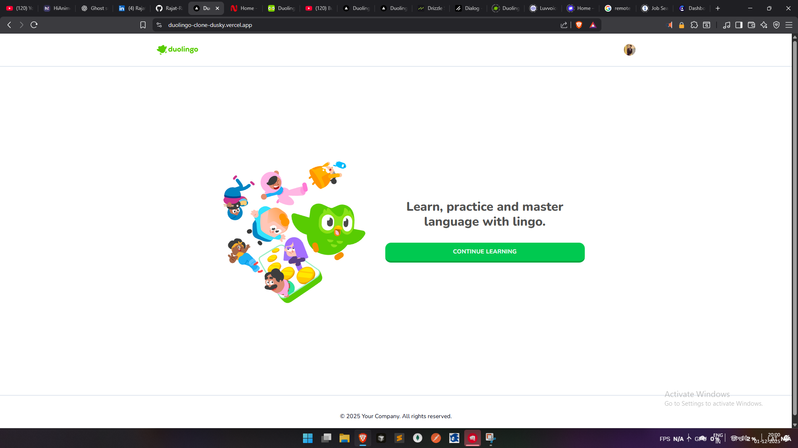
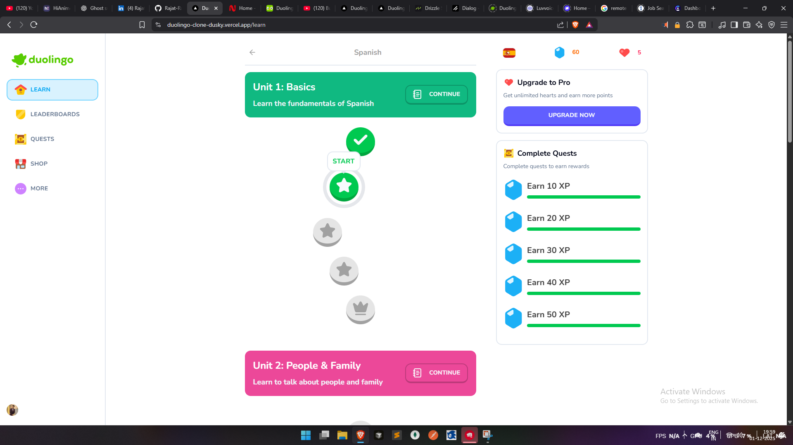
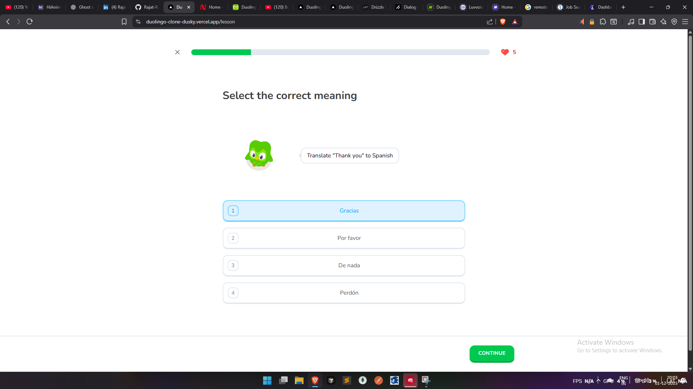
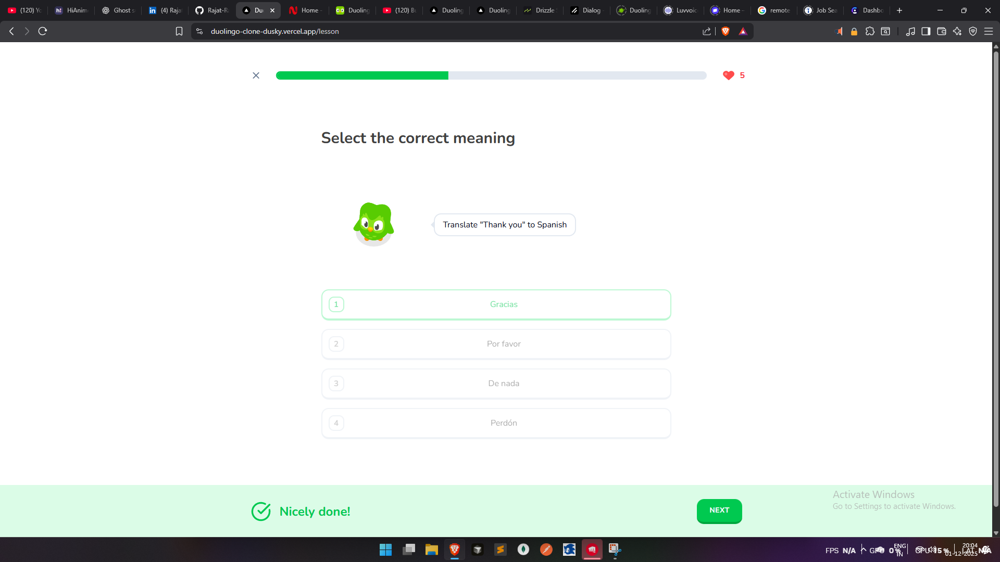
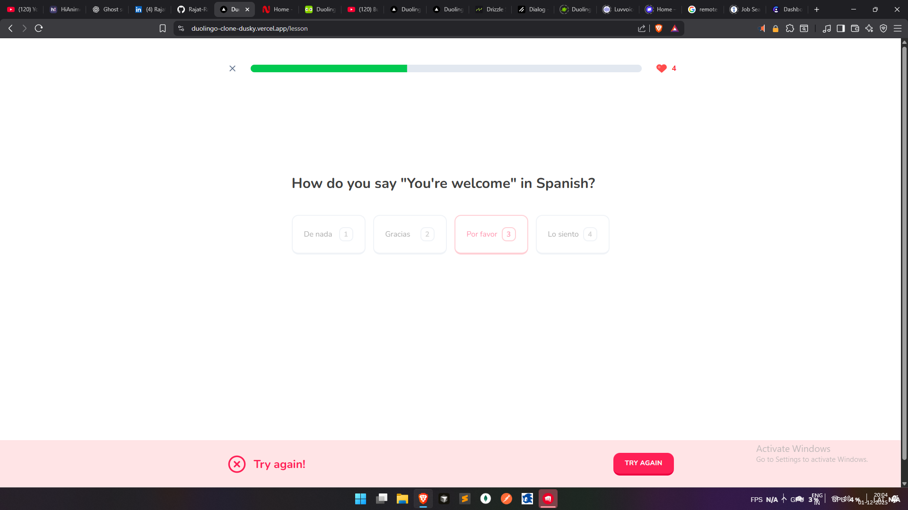
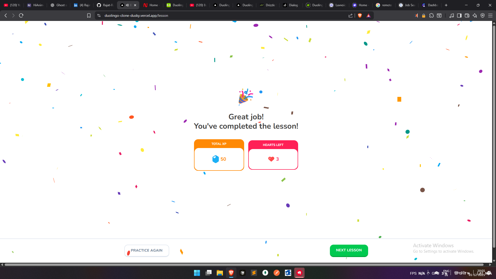
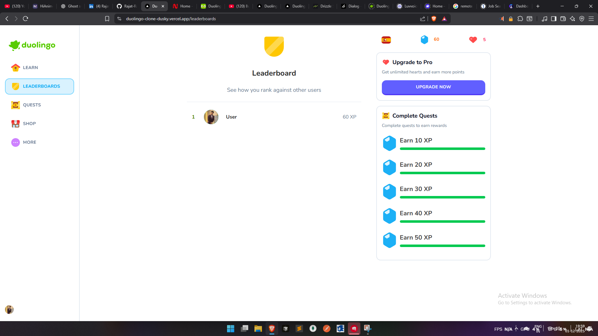
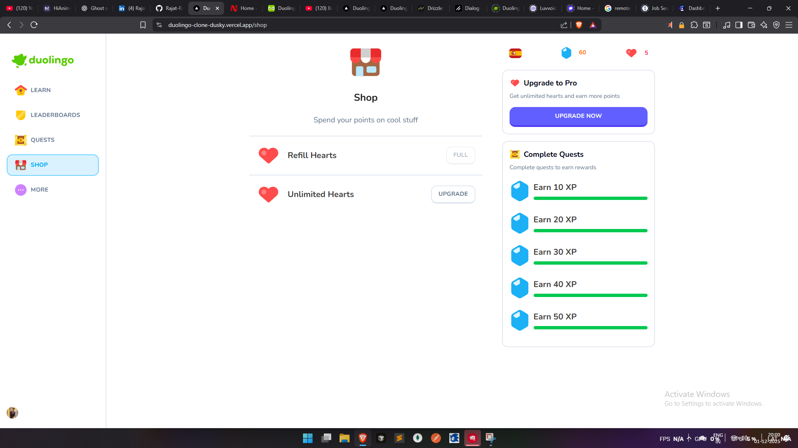

# 🦉 Duolingo Clone - Language Learning Platform

A full-featured language learning platform inspired by Duolingo, built with Next.js, TypeScript, and modern web technologies. Learn languages through interactive lessons, track your progress, compete on leaderboards, and unlock achievements.



## ✨ Features

### 🎓 Learning System

- **Interactive Lessons**: Complete lessons with multiple challenge types (SELECT, ASSIST)
- **Progress Tracking**: Track your progress through units and lessons
- **Hearts System**: Gamified learning with a hearts system (lose hearts on mistakes)
- **Lesson Completion**: Visual feedback and celebrations when completing lessons
- **Unit Structure**: Organized learning path with units containing 5 lessons each



### 🎯 Challenge System

- **Multiple Challenge Types**:
  - SELECT: Multiple choice questions
  - ASSIST: Translation and fill-in-the-blank exercises
- **Audio Support**: Listen to pronunciations
- **Image Support**: Visual learning with images
- **Real-time Feedback**: Instant feedback on correct/incorrect answers






### 🏆 Gamification

- **Points System**: Earn XP points for completing challenges
- **Leaderboards**: Compete with other learners and see top performers
- **Quests**: Complete daily quests to earn rewards
- **Shop**: Spend points to refill hearts or upgrade to Pro




### 💎 Premium Features

- **Stripe Integration**: Upgrade to Pro for unlimited hearts
- **Subscription Management**: Manage your subscription through Stripe
- **Pro Benefits**: Unlimited hearts and enhanced learning experience

### 👨‍💼 Admin Panel

- **Content Management**: Full CRUD operations for courses, units, lessons, challenges, and challenge options
- **React Admin**: Beautiful admin interface for managing all content
- **Easy Content Creation**: Add new courses, lessons, and challenges through the admin panel

## 🛠️ Tech Stack

### Frontend

- **Next.js 16** - React framework with App Router
- **TypeScript** - Type-safe development
- **Tailwind CSS 4** - Utility-first CSS framework
- **Radix UI** - Accessible component primitives
- **Lucide React** - Beautiful icon library
- **Zustand** - State management
- **React Confetti** - Celebration animations

### Backend & Database

- **Neon Database** - Serverless PostgreSQL
- **Drizzle ORM** - Type-safe ORM for database operations
- **Next.js API Routes** - Server-side API endpoints

### Authentication & Payments

- **Clerk** - Authentication and user management
- **Stripe** - Payment processing and subscriptions

### Admin

- **React Admin** - Admin panel framework

## 🚀 Getting Started

### Prerequisites

- Node.js 18+
- pnpm (or npm/yarn)
- Neon Database account (or any PostgreSQL database)
- Clerk account for authentication
- Stripe account for payments (optional, for production)

### Installation

1. **Clone the repository**

   ```bash
   git clone <your-repo-url>
   cd duolingo-clone
   ```

2. **Install dependencies**

   ```bash
   pnpm install
   # or
   npm install
   ```

3. **Set up environment variables**

   Create a `.env.local` file in the root directory:

   ```env
   # Database
   DATABASE_URL=your_neon_database_url

   # Clerk Authentication
   NEXT_PUBLIC_CLERK_PUBLISHABLE_KEY=your_clerk_publishable_key
   CLERK_SECRET_KEY=your_clerk_secret_key
   NEXT_PUBLIC_CLERK_SIGN_IN_URL=/
   NEXT_PUBLIC_CLERK_SIGN_UP_URL=/
   NEXT_PUBLIC_CLERK_AFTER_SIGN_IN_URL=/learn
   NEXT_PUBLIC_CLERK_AFTER_SIGN_UP_URL=/learn

   # Stripe (optional)
   STRIPE_SECRET_KEY=your_stripe_secret_key
   NEXT_PUBLIC_STRIPE_PUBLISHABLE_KEY=your_stripe_publishable_key
   STRIPE_WEBHOOK_SECRET=your_stripe_webhook_secret

   # App URL
   NEXT_PUBLIC_APP_URL=http://localhost:3000
   ```

4. **Set up the database**

   ```bash
   # Push database schema
   pnpm db:push

   # Seed the database with sample data
   pnpm db:seed
   ```

5. **Run the development server**

   ```bash
   pnpm dev
   # or
   npm run dev
   ```

6. **Open your browser**

   Navigate to [http://localhost:3000](http://localhost:3000)

## 📜 Available Scripts

- `pnpm dev` - Start development server
- `pnpm build` - Build for production
- `pnpm start` - Start production server
- `pnpm lint` - Run ESLint
- `pnpm db:push` - Push database schema changes
- `pnpm db:seed` - Seed database with sample data
- `pnpm db:reset` - Reset database (clears all data)
- `pnpm db:studio` - Open Drizzle Studio (database GUI)
- `pnpm db:generate` - Generate database migrations

## 📁 Project Structure

```
duolingo-clone/
├── app/                    # Next.js App Router
│   ├── (main)/            # Main app routes (learn, shop, leaderboards, etc.)
│   ├── (marketing)/       # Marketing pages
│   ├── admin/             # Admin panel
│   ├── api/               # API routes
│   └── lesson/            # Lesson pages
├── components/            # React components
│   ├── modals/           # Modal components
│   └── ui/               # UI components (shadcn/ui)
├── db/                   # Database files
│   ├── schema.ts         # Drizzle schema
│   └── queries.ts        # Database queries
├── actions/              # Server actions
├── lib/                  # Utility functions
├── scripts/              # Database scripts
│   ├── seed.ts          # Seed script
│   └── reset-db.ts      # Reset script
└── public/               # Static assets
    └── ss/               # Screenshots
```

## 🎮 Features in Detail

### Learning Flow

1. **Select a Course**: Choose from available language courses (Spanish, French, etc.)
2. **Start Learning**: Begin with Unit 1, Lesson 1
3. **Complete Challenges**: Answer questions and complete challenges
4. **Progress**: Unlock new lessons as you complete previous ones
5. **Track Progress**: See your progress through units and lessons

### Challenge Types

- **SELECT**: Choose the correct answer from multiple options
- **ASSIST**: Type or select the translation/answer

### Gamification Elements

- **Hearts**: Start with 5 hearts, lose one on incorrect answers
- **Points**: Earn XP for completing challenges
- **Streaks**: Track your learning streak
- **Quests**: Complete daily quests for rewards

## 🔐 Authentication

The app uses Clerk for authentication. Users can:

- Sign up with email
- Sign in with existing accounts
- Access protected routes (learn, shop, leaderboards, etc.)

## 💳 Payments (Stripe)

The app integrates with Stripe for premium subscriptions:

- Users can upgrade to Pro for unlimited hearts
- Subscription management through Stripe dashboard
- Webhook support for subscription events

## 🗄️ Database Schema

The database includes:

- **Courses**: Language courses (Spanish, French, etc.)
- **Units**: Units within courses (5 units per course)
- **Lessons**: Lessons within units (5 lessons per unit)
- **Challenges**: Challenges within lessons (2+ challenges per lesson)
- **Challenge Options**: Answer options for challenges
- **User Progress**: Track user progress, hearts, and points
- **User Subscriptions**: Stripe subscription data
- **Challenge Progress**: Track completed challenges

## 🎨 UI/UX Features

- **Responsive Design**: Works on desktop, tablet, and mobile
- **Dark Mode Support**: Theme switching capability
- **Skeleton Loaders**: Beautiful loading states
- **Animations**: Smooth transitions and celebrations
- **Accessibility**: Built with Radix UI for accessibility

## 🚢 Deployment

### Deploy to Vercel

1. Push your code to GitHub
2. Import your repository to Vercel
3. Add environment variables in Vercel dashboard
4. Deploy!

The app is optimized for Vercel deployment with Next.js.

## 📝 License

This project is for educational purposes.

## 🤝 Contributing

Contributions are welcome! Please feel free to submit a Pull Request.

## 📧 Contact

For questions or support, please open an issue on GitHub.

---

Built with ❤️ using Next.js, TypeScript, and modern web technologies.
